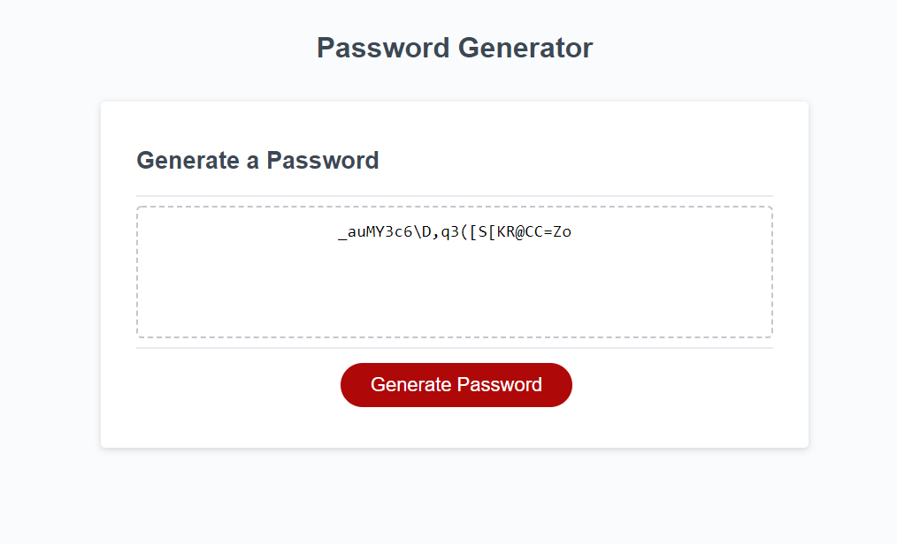

# password-generator

Upon pressing the generate button the function writepassword kicks on and and creates a variable rawpassword. 
### length of password
The function then asks the user how long of a password they would like and stores it as passLength. If the user chooses something outside of the range they are alerted and sent back to the beginning of the function.
### lowercase involement
Then the user is asked if they want lowercase letters and the user is notified that they are using lowercase letters if they confirm they want them. The lowercase letters are then added to the raw password.
### uppercase involement
Then the user is asked if they want uppercase letters and the user is notified that they are using uppercase letters if they confirm they want them. The uppercase letters are then added to the raw password.
### symbol involement
Then the user is asked if they want symbols and the user is notified that they are using symbols if they confirm they want them. The symbols are then added to the raw password.
### number involement
Then the user is asked if they want numbers and the user is notified that they are using numbers if they confirm they want them. The numbers are then added to the raw password.
### no choise notification
If the user doesn't choose an option they are notified and sent back to the beginning of the function writepassword.
### rawpassword generation 
Then the function writepassword randomizes all of the options selected together in a for loop.
### rawpassword to password
Then rawpassword is equal to password to send it to the html to be displayed on the page!

https://ryan-buckley1.github.io/password-generator/